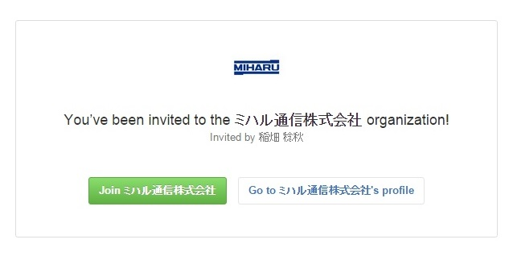

# GitHub への登録
## アカウント情報の入力
* [GitHub の登録ページ](https://github.com/join)　を開いてください。

### Username
* URL などに使用されるアカウント名です。
* コミットした際などにはこの情報も使われるので、なるべく誰なのかが分かる名前にしてください。
    * 半角英数字です。
    * クラウド上のサービスのユーザー名なので結構な確率で短いものは使えないです。

### Email Address
* 会社の Eメールアドレスを使用してください。

### Password
* 各自で管理してください

## プランの選択
* Free を選択してください（Chosenにする）
* Help me set up an organization next のチェックは入れなくていいです

## メールアドレスの確認
* 登録したメールアドレスに確認用のメールが来ます
* 『[GitHub] Please verify your email address.』というタイトルの付いたメールを開き、`Verify email address` をクリックしてください
* ブラウザが開いてメールの認証が完了します
    * 場合によっては、ログイン画面が出てくるので、その場合は先程登録したアカウントでログインしてください

# MiharuCommunications への参加
* 非公開設定になっているレポジトリへアクセスするために、MiharuCommunicationsグループへ参加してください。
* ユーザー側から、参加申し込みが出来ないので少し手順が面倒くさいです

## アカウントを伝える
* [フォロー画面](https://github.com/inahata/followers) を開き `inahata` さんを `Follow` してください
* その後、本人に直接伝えて下さい

## Join
* 招待の作業が終わると、登録したメールアドレスにグループへの招待メールが来ます。
* `[GitHub] 稲畑 稔秋 has invited you to join the ミハル通信株式会社 organization` というタイトルのメールを開き、`follow this link:` の次にあるリンクをクリックしてください
* リンクを開いた先のページの `Join ミハル通信株式会社` をクリックすればグループへの参加は完了です。
* [ミハル通信のページ](https://github.com/MiharuCommunications) を開いて `PRIVATE` と付いているレポジトリが見れることを確認してください。

#
