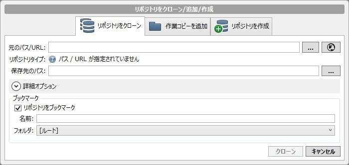
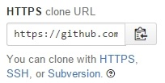

# SourceTree の場合
* ツールバー左端の『新規 / クローンを作成する』ボタンをクリック

## リポジトリをクローン/追加/作成 ダイアログ

### 元のパス/URL
* レポジトリの URL です
* ブラウザで GitHub 上のリポジトリを開いたページの右側に書いてあります
    * URL が `https` で始まっていない場合は、`HTTPS` ボタンを押してください

### 保存先のパス
* リポジトリをローカルにコピーするフォルダです
* このフォルダの中に、リポジトリの中身がコピーされます

### ブックマーク
* 画面左側に表示される、リポジトリの一覧に関する情報です。
