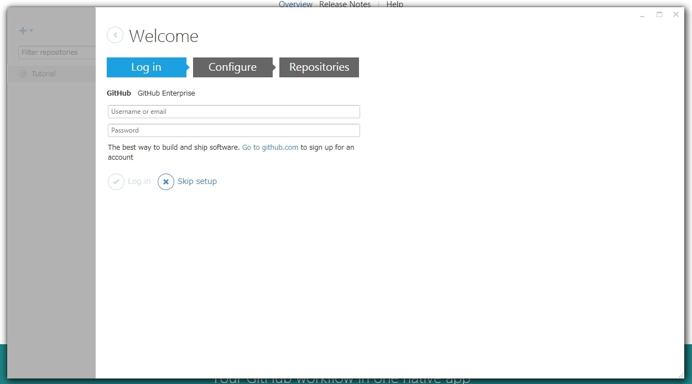
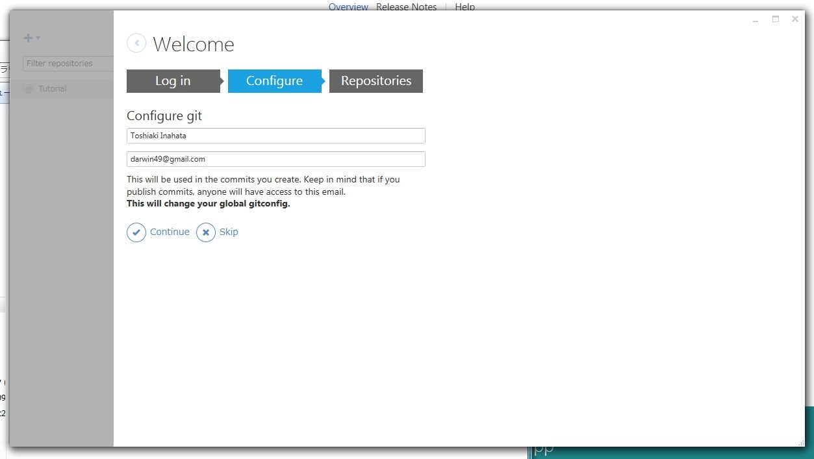
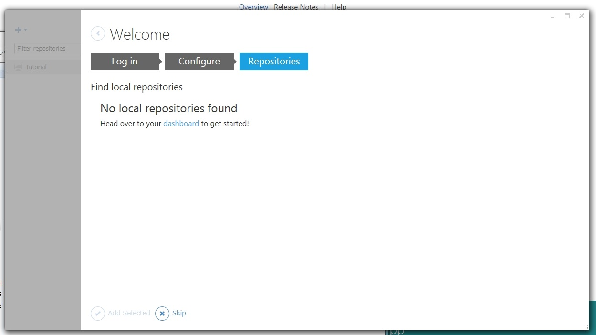

# GitHub Desktop のインストール手順

## ダウンロード
* [公式のダウンロードページ](https://desktop.github.com/) からダウンロードしてください

## インストール
* ダウンロードしたインストーラーを起動し、インストールを開始してください
* インストールが完了したら初期設定のウィザードが出てくるので設定を行います

## GitHub アカウントの入力
* GitHub のアカウント情報を入力してください
* 入力すると GitHub とのひも付けが自動で行われます

## Git のグローバル設定の入力
* Git 全体で利用するメールアドレスと名前の設定を行います
* GitHub にコミットした際に使用され、そのコミットがどのアカウントが行ったかの判定(Web画面での表示用)するために利用します

## 既存のレポジトリの検索
* ソフトがローカルにある Git レポジトリを自動的に探してくれます
* GitHub Desktop で管理する場合は選択して追加してください
* 追加したくない場合は Skip 出来ます

## 完了
* GitHub への キーの追加も自動でしてくれているので、そのまま使いはじめることが出来ます
