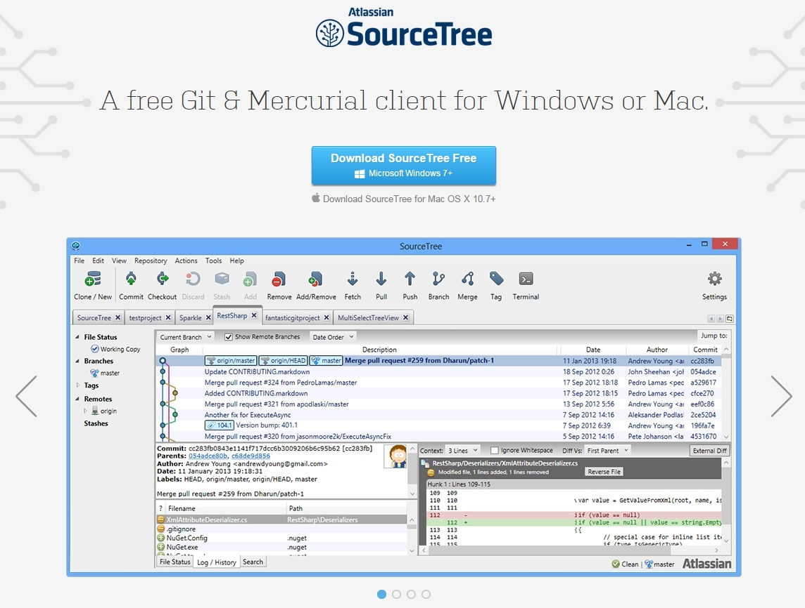
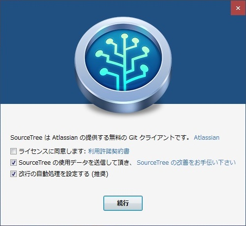
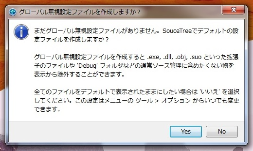
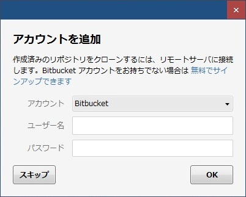
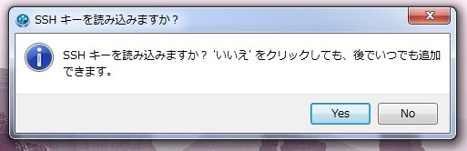

SourceTree のインストール手順
=========================
## ダウンロード
* [ダウンロードページ](https://www.sourcetreeapp.com/) からダウンロードしてください

## インストール
* ダウンロードしたインストーラーを起動しインストールを行ってください

### SourceTree の設定
* `ライセンスに同意します` にチェックを入れて `続行`

### グローバル設定
* PC 全体での共通の無視するファイルのパターンを生成するかどうかです
* OS 共通の不要なファイルなどが登録されます
* グローバル無視設定ファイルは、あったほうがいいので `YES` が無難です。

### 外部アカウントの登録
* [BitBucket](https://bitbucket.org/), [GitHub](https://github.com/) のアカウントの登録です。
* 特にしなくてい大丈夫です。

### SSH キーの登録
* 暗号化通信のための SSH キーの読み込みを行います。
* 特に必用はないです。

