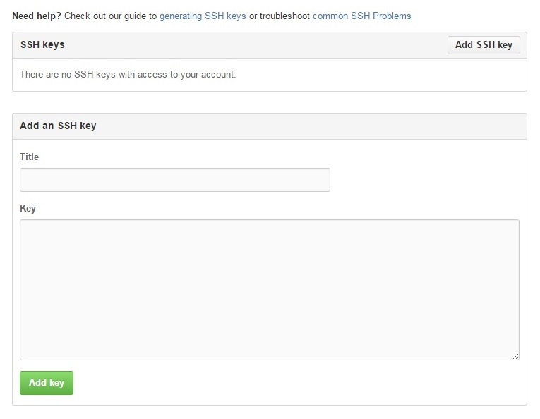

# SSH キーの登録
* `git@` で始まる URL のレポジトリとやり取りをするための暗号化鍵の登録
* `https` で始まる URL を利用するだけなら必要ない

* SourceTree のメニューから `ツール` -> `SSH キーの作成/インポート` を選択
    * `Actions` の `Generate` をクリック
    * キーの生成が始まるので、`Key` グループボックスの中で適当にマウスを動かす
    * キーが生成されたら、`Save public key` と `Save private key` をクリックしてそれぞれの鍵を保存する
        * セキュリティーの観点から行くと、`private key` には `passphrase` を登録しておいたほうがいい
        * `passphrase` は無くても動く
    * 画面は閉じずに次へ

* [GitHub の SSH Key の設定ページ](https://github.com/settings/ssh) を開く
    * リンクから開けない場合は、GitHub 上で、右上のプロフィールアイコンをクリックして、ドロップダウンのメニューから `Setting`
    * 開いたページの、左のメニューから `SSH Keys`
* `Add SSH Key` をクリック

* SSH Key を追加
    * `Title` に適当な名前を
    * `Key` に先ほど生成したキーを（下の画面の大きい方の黒の部分）
    * それぞれ入れて、`Add Key`

* タスクバーの通知領域から `Pageant (PuTTY authentication agent)` を右クリックして `Add Key` をクリック
* 先ほど保存した `private key` を選択する

* これで、SSH Key の設定が完了
